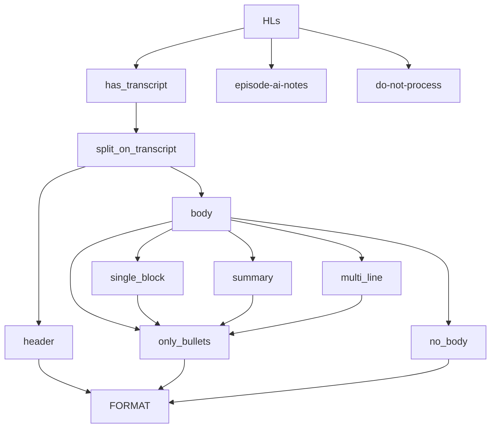

# Highlight formats

This is the shape:

**TYPES OF HIGHLIGHT:**
    12906 - Contain str 'Transcript:'
      299 - Contain str 'Episode AI Notes:'
        0 - Oddities we do not process
    13205 - TOTAL HIGHLIGHTS COUNTED


**TYPES OF TRANSCRIPT_HIGHLIGHT_BODY**
      127 - Empty body
     5863 - Bullets'
       31 - Summary
     6881 - Single block
        4 - Multi-line
    12906 - TOTAL TRANSCRIPT HIGHLIGHTS COUNTED


## Cases Summary




## 'Transcript:` is consistent across formats

hl.text mostly includes the text `'Transcript:'`
  - includes =  12906
  - doesn't include =  299

Therefore, we will now split hl.text on `'Transcript:'`
  - have revised `split_transcript` to work on text split on this
  - speaker, quote seems to work (e.g. output first value in tuple and we get just speakers)

For the 299 highlights **without** `'Transcript:'`
    - almost all are `"Episode AI notes"`
    - These can be formatted as standalone
    - Basic example:

```
"Episode AI notes\n\n1. The speaker finds humor in Donald Trump's unconventional and sometimes rambling delivery, highlighting his comic timing and campy nature.\n\n2. A politician receives strong support from white evangelicals by tapping into an old American tradition of carnival, circus, and preacher-like charisma reminiscent of iconic figures like Billy Graham."
```

## How to process the pre `"Transcript:"` text?

### Highlight header

We can reliably get the headlight heading by:
- first replacing double line breaks with single
- then splitting on a line break.

There is an issue with maybe 50 highlights not having a highlight header.
- these are easily identified as startign with "-"

Simplest solution is to use the first summary bullet as the header.
- some may be overlong, or not quite make sense
- but is few quotes and a simple solution

### Remaining summary text

The rest of the text then becomes a list of split lines.

We can make bullets uniform by replacing '•' and '*' with the currently used '-' 

#### Examples

These are the types of body:

##### no-body
```python
if len(hl_body) == 0:
```

[]

##### bullets
```python
elif hl_body[0].startswith('-'):
``` 
[
  '- Membership to our chat community is available on therestispolitics.com', 
  '- Listeners on Apple Podcast can easily subscribe for early access and ad free listening', 
  '- The hosts are Alistair Campbell and Rory Stewart', 
  '- Alistair Campbell is in Cape Cod, United States', 
  '- A tennis racket can be seen on the wall behind Alistair', 
  '- The tennis racket is old and has been used for a long time', 
  '- Alistair traveled on a tiny plane to reach his current location'
]

##### summary
```python    
elif "Summary:" in hl_body:
```

[
  'The central question is what mix of data sets should you use?', 
  'There are various considerations, such as different data sources, the importance of repetition (quality vs quantity), and the definition of good quality data. The belief that code or spending time on good sources like Wikipedia improves models lacks evidence.', 
  'Different data mixes yield varied results, with C4 dataset performing exceptionally well despite its problematic pre-processing.', 
  'Evaluating models for generation tasks is challenging, as there is uncertainty about what to measure.', 
  'Making reasonable choices based on evaluation becomes crucial.'
]

##### single-block
```python
elif len(hl_body) == 1:
```
[
  'The conversation highlights the roles and backgrounds of Pablo Alino and Matt Wysnisky, who are involved in Python community projects and work at Bloomberg. They discuss the use of profilers in Python, specifically C profile and profile from the standard library.'
]

##### multiline
```python
elif len(hl_body) > 1:
```

[
  'The podcast episode discusses several interconnected long-term trends that have profoundly shaped modern society, starting from the Industrial Revolution.', 
  
  '--The Industrial Revolution and its ripple effects:--', 
  
  '- The Industrial Revolution, beginning in the late 18th century, was fundamentally an energy revolution that transformed economies and work patterns. It led to a massive migration to cities, increased wealth, and advancements in medicine that drastically reduced child and maternal mortality. ',
  
  '- This, in turn, enabled women to enter the workforce, altering family structures, birth rates, and the overall nature of the economy. ', 
  
  "- Fewer children dying and women's increased participation in the workforce contributed to an aging population. This is a challenge because fewer working-age people support an increasing elderly population. ",
  
  '- The rise of the contraceptive pill further impacted fertility rates, giving women more control over family planning. ', 
  
  "- Automation of household tasks also played a part in women's increased participation in the labor market. ",
 
  '--Globalization and its consequences:--', 
  
  '- Globalization, particularly the free movement of capital and goods, led to a shift from a manufacturing-based to a service-based economy. ', 
  
  '- This made it more challenging for countries like the UK to compete internationally on manufacturing, forcing a focus on higher-skilled, service-based industries. ', 
  
  '- However, globalization also introduced increased vulnerability to global risks, such as pandemics and supply chain disruptions. ', 
  
  '- The increasing importance of education for success in the modern, service-based economy created a credentialist society and exacerbated social divisions. ', 
  
  '--The changing role of the state:--', 
  
  '- While globalization initially diminished the role of the state, recent events like the 2008 financial crisis and the COVID-19 pandemic have shown an increased reliance on state intervention and interventionism. ', 
  
  "- There's a growing expectation that the state should play a more active role in addressing social and economic challenges, yet there's simultaneous distrust in the competence of politicians."]