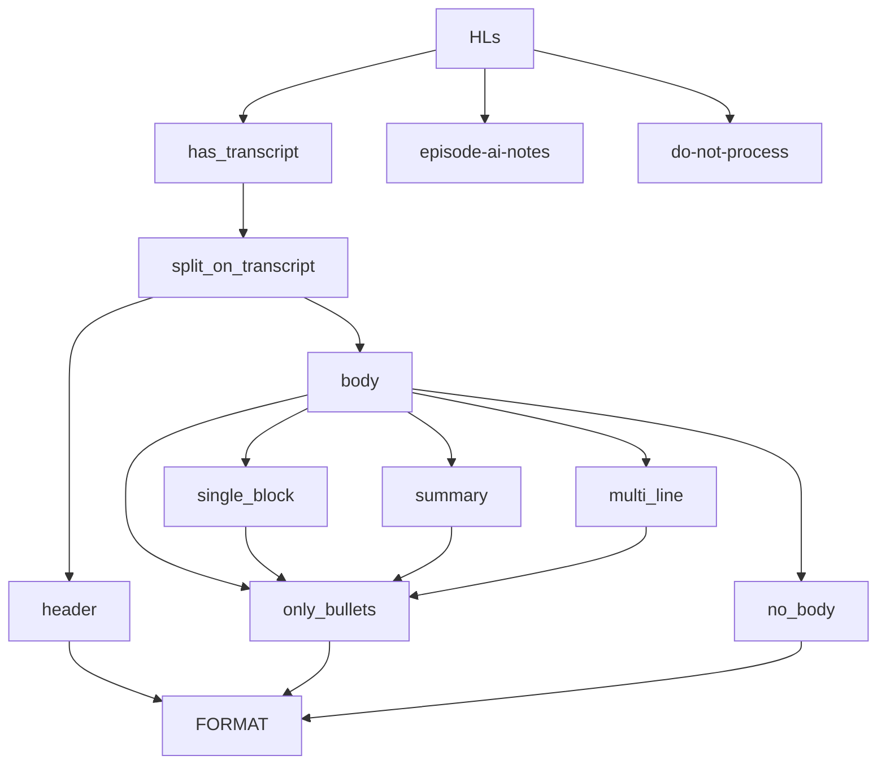

# Highlight formats

This is the shape:

**TYPES OF HIGHLIGHT:**
    12906 - Contain str 'Transcript:'
      299 - Contain str 'Episode AI Notes:'
        0 - Oddities we do not process
    13205 - TOTAL HIGHLIGHTS COUNTED

**TYPES OF TRANSCRIPT_HIGHLIGHT_BODY**
      127 - Empty body
     5863 - Bullets'
       31 - Summary
     6881 - Single block
        4 - Multi-line
    12906 - TOTAL TRANSCRIPT HIGHLIGHTS COUNTED

## Cases Summary

## 'Transcript:` is consistent across formats

hl.text mostly includes the text `'Transcript:'`
  - includes =  12906
  - doesn't include =  299

Therefore, we will now split hl.text on `'Transcript:'`
  - have revised `split_transcript` to work on text split on this
  - speaker, quote seems to work (e.g. output first value in tuple and we get just speakers)

For the 299 highlights **without** `'Transcript:'`
    - almost all are `"Episode AI notes"`
    - These can be formatted as standalone
    - [Basic Episode AI Notes example](79_examples.md#episode-ai-notes-example)

## How to process the pre `"Transcript:"` text?

### Highlight header

We can reliably get the headlight heading by:
- first replacing double line breaks with single
- then splitting on a line break.

There is an issue with maybe 50 highlights not having a highlight header.
- these are easily identified as startign with "-"

Simplest solution is to use the first summary bullet as the header.
- some may be overlong, or not quite make sense
- but is few quotes and a simple solution

### Remaining summary text

The rest of the text then becomes a list of split lines.

We can make bullets uniform by replacing '•' and '*' with the currently used '-' 

There are five types: 
- no-body
- bullets
- summary 
- single block
- multiline 

[Summary text types - examples](79_examples.md#summary-text-types-examples)

