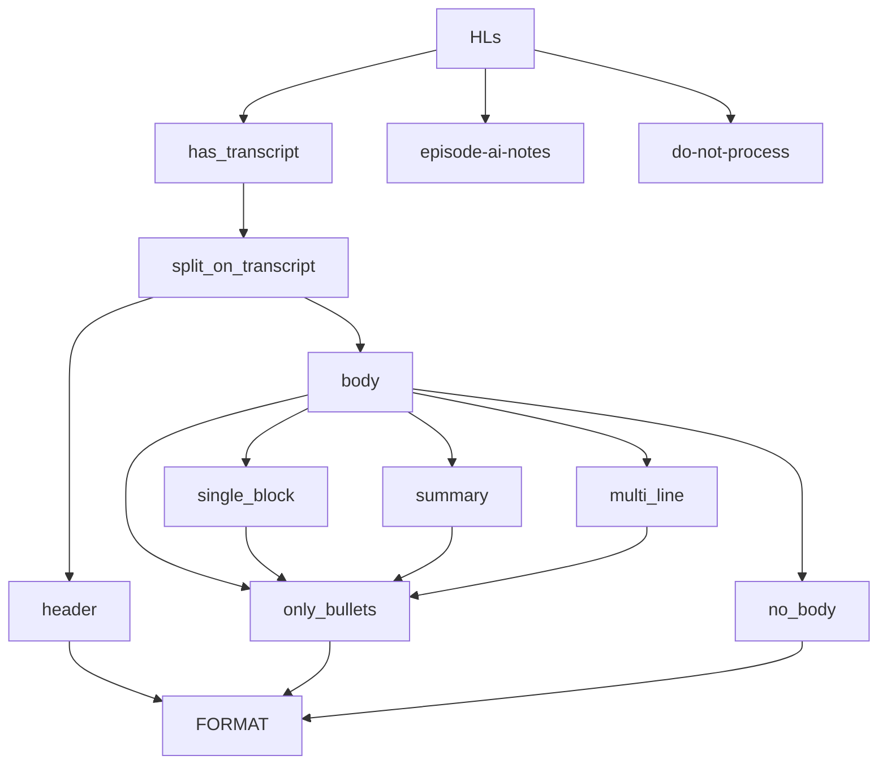

# Ticket Notes - 79 add obsidian sync mvp

(We're trying writing "github comment" style notes here as writing
in online text boxes when we spend all day in a text editor is 
silly.)

## Top level overview

(When complete move into the new )

- In DB Export:
    - `DbHls` is a parent object for a database export; it groups Hls (into by_book, by_snipd_url)
    - `HighlightFromDB` and `BookFromDB` now include ALL db fields, and additional helper fields
    - `SnipdEpisodeByDB` is a grouping of `BookFromDb`s with the same Snipd URL
        - So effectively a container object for books and highlights
    - `SnipdHighlightTranscript` and `SnipdHighlightAiEpisodeNotes` are instantiated with a `HighlightFromDb` and contain processing methods

Current structure:

### `db_export.py`

- `DbHls`
    --> groups `HighlightFromDb`s by:
        - `BookFromDb`
        - `SnipdEpisodeFromDb`

    --> `HighlightFromDb` are ALREADY enriched 
        - adds `HighlightFromDb` properties
        - if a `BaseFmtr` is configured to the `hl_type`/`snipd_hl_snipd`
            - e.g `SnipdTranscriptFmtr`/`SnipdEpisodeAIotesFmtr`


### `db_analysis.py`

- `DBHlAnalysis`
    --> takes a `DbHls`
        - `@order_property`(ies) 
        - grouped with methods generating property's underlying stat(s)
        - likely will become purpose specific subclasses(Export? Source? 'Problem?')


### `obsidian_snipd.py`

- Driver function

```python
def write_dbhls_to_obsidian(
        user_config: UserConfig, query_shortname: str, batch_id: int | str,
    ) -> None:
```

--> takes a `query_shortname` and a `batch_id`
    --> instantiates a `Dbhls` with them
        --> iterates over `Dbhls.hls_by_snipd_url`
            --> populates them with `<hl_by_snipd_url>.populate`
                --> writes `<hl_by_snipd_url>.full_page` to Obsidian 

Working back to `<hl_by_snipd_url>.full_page`:
    --> `SnipdEpisodeFromDb`
        --> `SnipdEpisodeFromDb.populate`
            --> podcast_title
            --> episode_title
            --> front_matter
            --> page_body
            (all from already enriched Hls)


## Useful facts

Found out during the ticket.

- For all snipd books, `source_url` and `unique_url` are identical
- Will use `source_url` as makes most semantic sense

- All non AI hls have location

- All Hls have `highlighted_at` and `created_at`

QUESTION: Do Episode AI Notes hls have urls?
- ✅ YES! They have 'episode-takeaways' urls!  

QUESTION: Are there any other hl types (e.g not book)?
- ✅ Nope - just `snip` and `episode-takeways`.

### Deduplication facts

- Books has a snipd 'episode' url
    - Duplicate books share the same snipd episode url   

- Hls have a snipd 'snip' url
    - Duplicate hls share the same snip url

Duplicate Hls also share:
    - same location
        - NOTE: different Hls can share the same location
        - E.g. pressing the snip button at similar points and snipd picks same starting point
    - same highlighted_at
        - NOTE: different Hls can share the same highlighted
        - Even though it's a milisecond timestamp??
        - This I don't get, but the evidence is clear

- By using hl url we (think) we are guaranteeing uniqueness...
    - i.e. all identical urls will have the same `highlighted_at` and same `location`
        - therefore those are moot

We look at `url` - and if there are more than one, we look at `created_at` and take
the latest.

This is true even for hls without `location` - their duplicates will also have no 
location.  

This was key functionality and can be found in `SnipedEpisodeFromDb._generate_hls`.

### Highlight formats

This is the shape:

**TYPES OF HIGHLIGHT:**
    12906 - Contain str 'Transcript:'
      299 - Contain str 'Episode AI Notes:'
        0 - Oddities we do not process
    13205 - TOTAL HIGHLIGHTS COUNTED

**TYPES OF TRANSCRIPT_HIGHLIGHT_BODY**
      127 - Empty body
     5863 - Bullets'
       31 - Summary
     6881 - Single block
        4 - Multi-line
    12906 - TOTAL TRANSCRIPT HIGHLIGHTS COUNTED

### Book Ordering

Used in `SnipdEpisodeFromDb`

- Hls are extracted ordered by
    - book_id
    - highlighted_at
    - id

- Effectively pre-grouped by book...
- book_ids are in order they are created at
- ∴  duplicate books would appear later in `hls_by_book_dict/hls_by_book`

- `_generate_hls_by_snipd_url_dict` iterates in order and appends books
- ∴ `SnipdEpisodeFromDb.hls_by_snipd_url[xxx].books` will be in oldest first order

Quick fix is just use last list item.
- Brittle sure, but it's low stakes and fine now, probably good enough long term

### 'Transcript:' str reliable 

hl.text mostly includes the text `'Transcript:'`
  - includes =  12906
  - doesn't include =  299

Therefore, we will now split hl.text on `'Transcript:'`

For the 299 highlights **without** `'Transcript:'`
    - almost all are `"Episode AI notes"`
    - formatted seperately with their BaseFmtr

## Hl Cases Diagram



## BIG ISSUE - duplicate hls

Readwise is cautious when deduplicating highlights.  
Great for them - not great for our use case.

See [readwise duplicates](../features/readwise_duplicates.md).

For snipd we cannot ignore with ~30% Hls effected.

### Solutions considered

1. Fix the Readwise database itself
    - Manually confirm, episode by episode, what can be deleted
    - Run the deletions
    - Assumes deletion is reliably counted as a "change" in and added to new batches
    - Reliably for both books and highlights

2. Workaround is fix in the Obsidian export
    - The RW db dupes themselves matter little
    - We know we have a reliable indicator there in the snipd URL

Export side fix was chosen.

- keep the db an exact mirror
- super easy to delete wrong highlights!
- `db_export.py` approach makes post-processing deduplication composable
- much simpler!
- data sizes trivial

#### Obsidian side Fix - Top Level

There are two observed failure types:

    1) Updates to old episodes
    2) New listening sessions where "something" ignores the deduping

The workflow is: 

- tbc, to complete

For an episode that already exists
    - delete the old episode from Obsidian
    - recreate a new one
    - log a warning (original ep was deleted with rw link to old ep?)
    - include rw link to old ep in the new episode export

Possible flow:
- revision found
- existing page check
- existing page found...
- existing page deleted...
- pull all highlights by snipd-uid
- write out page
- skip the remainder in the current batch

- ***THIS ISN"T BUILT OR TESTED YET!!!***

#### Existing page overwriting

This may or may not work with Obsidian linking quoting etc.

It depends on how much that's ever done too? Does it matter.

It's hard to solve simply - and, since may be unimportant - is out of scope for
this ticket.

## Misc issues with weak fixes

Not considered worth proper fixes - but look out for more issues in usage.

✅ Added handling for question marks, ellipsis and full stops...
    - It's still not perfect (e.g. Mr A.B. Cod) 
    - replace with ntlk/AI calls when we use those for importing

✅ Make db query snipd only - there is some old "other" podcast junk in batch 1

✅ Add handling for ~50 hls have no header (identified by not starting with '-')
    - using first summary bullet as the header
    - maybe too long in theory but no cases observerd,

QUESTION: Where should Episode AI Notes go in the ordering?
- non-snipd hls get a int 0 location
- ❌ Problem, these are not always first
    - Ignore. No ticket. Will annoy me and I will fix if an issue.

